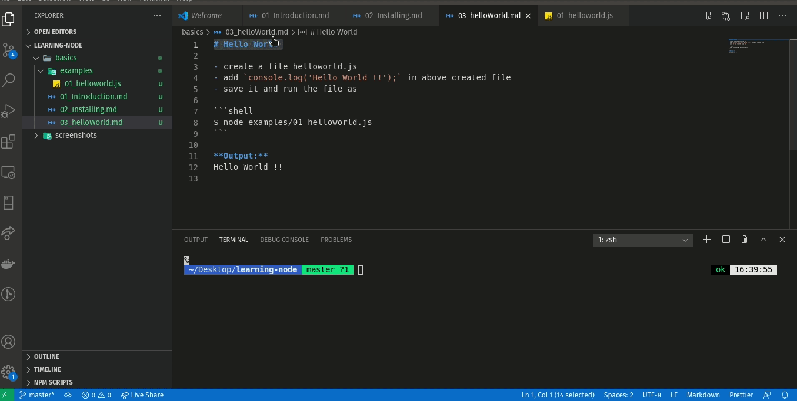

# Hello World 

- create a file helloworld.js 
- add `console.log('Hello World !!');` in above created file
- save it and run the file as 

```shell
$ node examples/01_helloworld.js
```

**Output:**  
Hello World !!



[01_helloworld.js](./examples/01_helloworld.js)