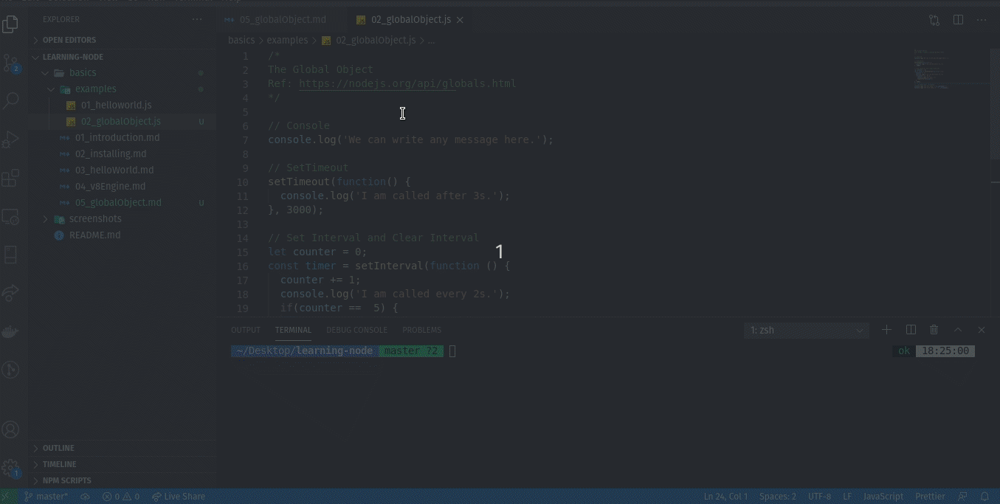

# The Global Object

When we write the javascript in browser, the global object is **window**. We can access the various property, objects using that window object such as alert, setTimeout etc.    

But, when we write the JavaScript in Node.js, the global object is no longer the window object because we are not in the browser any more. The global object in node is the object called **global**. It give access to some method which can be used straight out of the box in Node.js.     

We can use all the utility here, anywhere in the Node.js application because they sit on the global object.  

I will leave a link to that documentation page to the Global object so you can go and  have a look through that. There are couple more things that you might want to look at.  

Ref: [https://nodejs.org/api/globals.html](https://nodejs.org/api/globals.html)  

And in your code when you write:
- console.log(this) in an empty js file(module) it will print an empty object {} referring to your empty module.
- console.log(this); inside a self invoking function, this will point to the global nodeJS scope object which contains all NodeJS common properties and methods such as require(), module, exports, console...
- console.log(this) with strict mode inside a self invoking function it will print undefined as a self invoked function doesn't have a default local scope object in Strict mode.
- refer [this file](./examples/02_globalObject.js) for other example.

