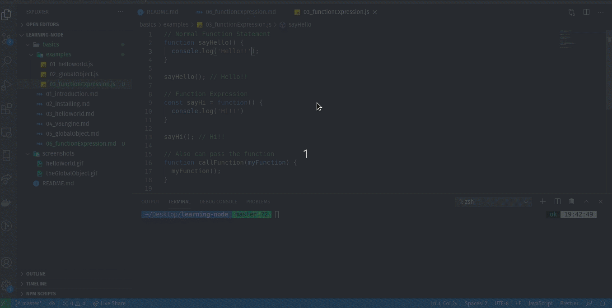

# Function Expression

A function expression is very similar to and has almost the same syntax as a function declaration. The main difference between a function expression and a function declaration is the function name, which can be omitted in function expressions to create anonymous functions.  

The normal function statement in JavaScript   
```javascript
// Normal Function Statement
function sayHello() {
  console.log('Hello!!');
}

sayHello(); // Hello!!
```
can be written as 

```javascript 
// Function Expression 
const sayHi = function() {
  console.log('Hi!!')
}

sayHi(); // Hi!!
```

Refer [this file](./examples/03_functionExpression.js) for other examples.  

 
