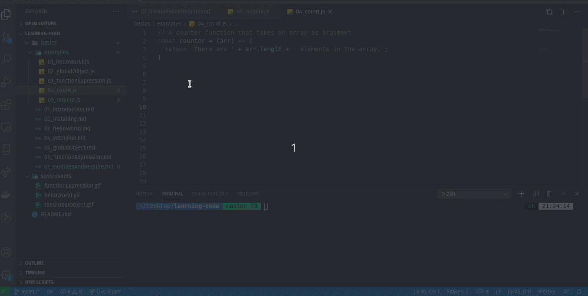
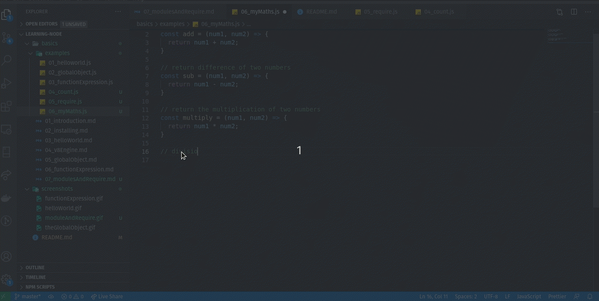

# Modules and require()

When we write nodejs application, we don't typically dump all of our application code in one file and just let it run. That will be difficult to manage and other developer to refactor, extend, contribute to the project. So, what we do is we slipt the code into logical modules. We have different modules which has a certain functionalites in our application. Then, we call upon those modules whenever we need them. 

Consider a module, utility module, that count something. Then we can simply call that module when we need to count something in our application. A module is just another javascript file. 

Let's us make a function that count the length of an array. 
```javascript
// A counter function that takes an array as argument
const counter = (arr) => {
  return 'There are ' + arr.length + ' elements in the array.';
}

// const result = counter(['Leapfrog', 'Deerwalk', 'Cotiviti', 'F1Soft', 'Machnet']);
// console.log(result);
```

Now, if we want to use the above function in other JavaScript file, we use `require` function. The require function is in the global object of the Node.js, we can use it where necessary. 

```javascript
// in another file
// require('path')
require('./04_count');

const result = counter(['Leapfrog', 'Deerwalk', 'Cotiviti', 'F1Soft', 'Machnet']);
console.log(result);
```

Running the above code gives an error because the method `counter` is not available outside the 04_count.js module and that is intensional even though we required it. We need to say explicitly what part of module we want to make available to the file that requires this module. 

The way we do that is by `module.export = <whatever we want to make available outside>` as shown in following example.

```javascript
const counter = (arr) => {
  return 'There are ' + arr.length + ' elements in the array.';
}

module.export = counter;
```
and simply assign into a variable while importing the module. 

```javascript
const counter = require('./04_count');

const result = counter(['Leapfrog', 'Deerwalk', 'Cotiviti', 'F1Soft', 'Machnet']);
console.log(result); 

```

#### Example Code
- [Count Module](examples/04_count.js)
- [Import Example](examples/05_require.js)



That how we create a module and require in another javascript file.

### Module Patterns

We created our first module to count the length of the array. We simply just applied `module.exports = counter` so that this is now made accessible wherever we require that module. But what if we want to return the various things for example the module that return various mathematical functionalities.  

Now, lets add various mathematical function in the [myMaths module](examples/06_myMaths.js) and export all the functionalities as 

```javascript
module.exports = {
  add,
  sub,
  multiply,
  divide
}
```
and simply use it as shown in [mathsExample file](examples/07_mathsExample.js)


