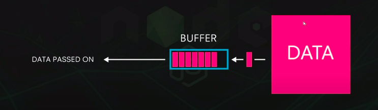
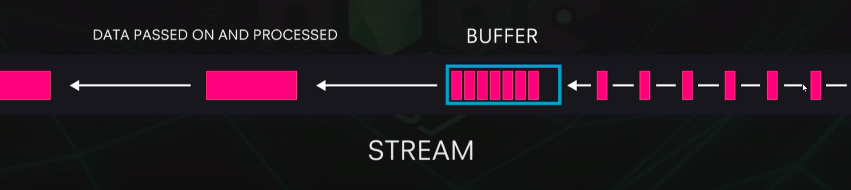
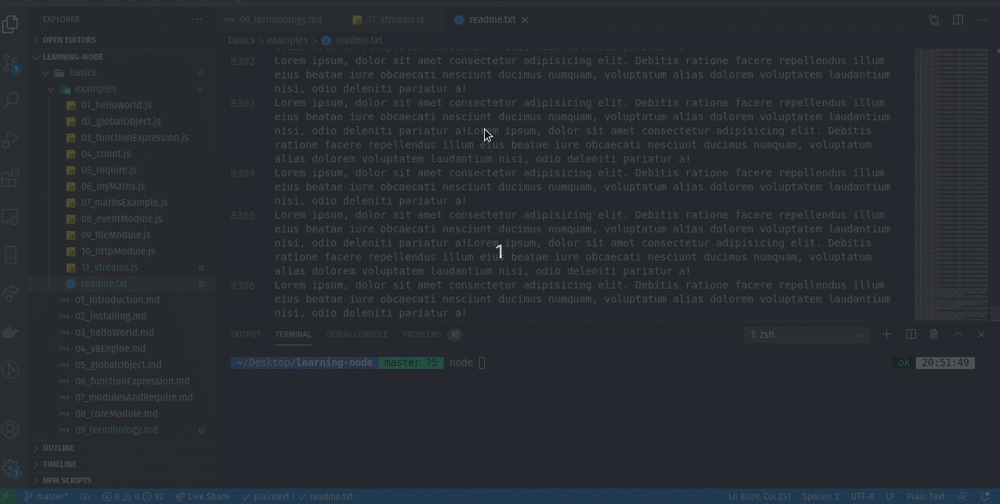
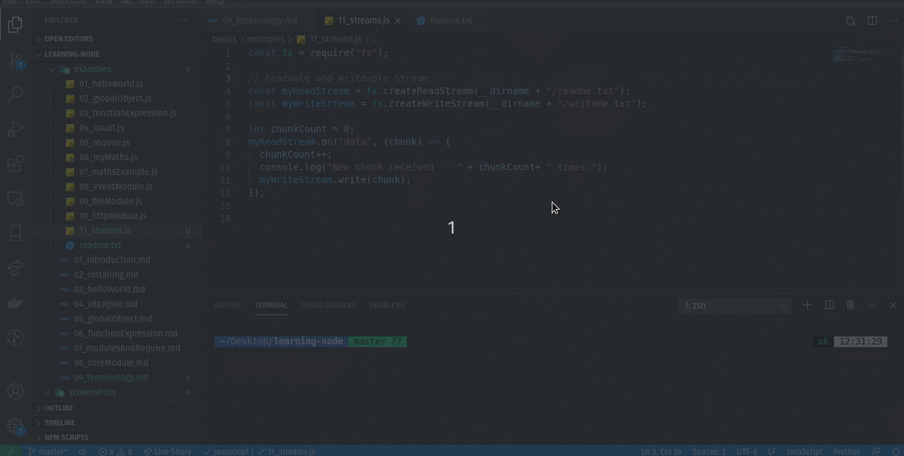
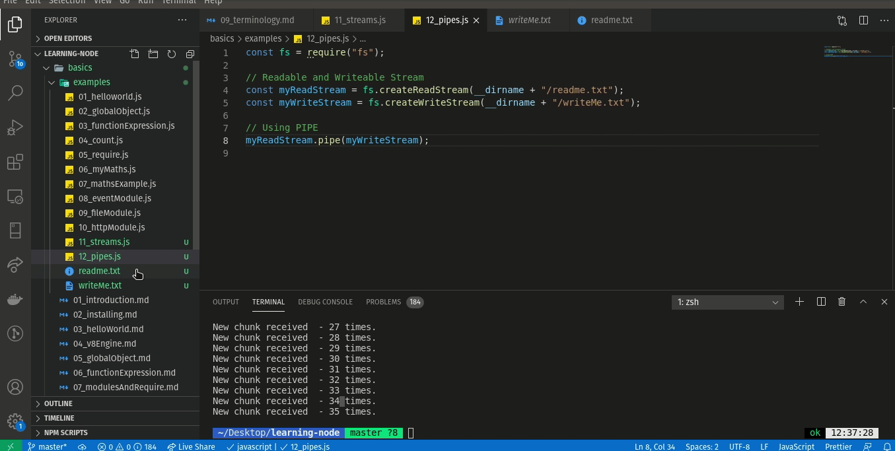

# Buffer, Streams and Pipe in Node.js

#### Buffer
- Temporary storage spot for a chunk of data that is being transferred from one place to another.
- The buffer is filled with data, then passed along.
- Transfer small chunks of data at a time. 

#### Stream
A stream is a data flows over time from one place to another. 

#### Stream in Node.js
We can create streams in Node.js to transfer data. It increase the performance.

- **Writable Streams:** allow node js to write data to a stream
- **Readable Streams:** allow node js to read data from a stream
- **Duplex:** can read and write to a stream
___
##### Readable Streams

##### Writable Streams

Example file: [Streams Example](./examples/11_streams.js)

#### Pipes

Example file: [Pipes](./examples/12_pipes.js)
