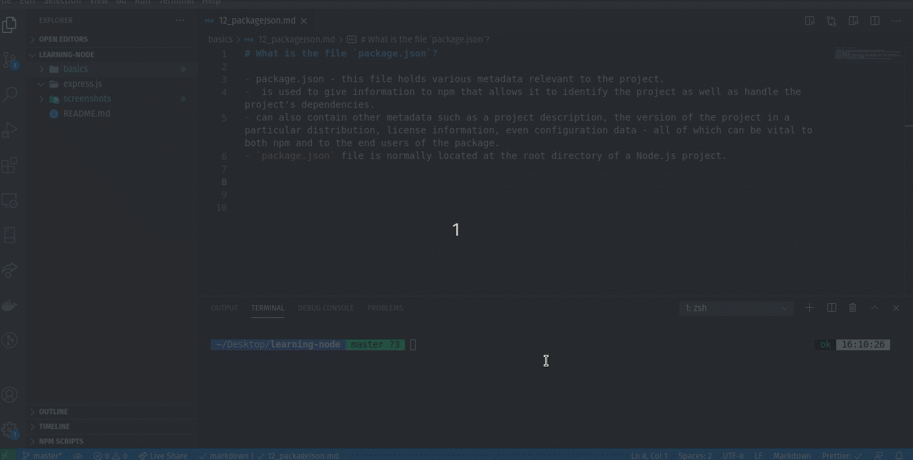

# What is the file `package.json`?

- package.json - this file holds various metadata relevant to the project.
- is used to give information to npm that allows it to identify the project as well as handle the project's dependencies.
- can also contain other metadata such as a project description, the version of the project in a particular distribution, license information, even configuration data - all of which can be vital to both npm and to the end users of the package. 
- `package.json` file is normally located at the root directory of a Node.js project.

