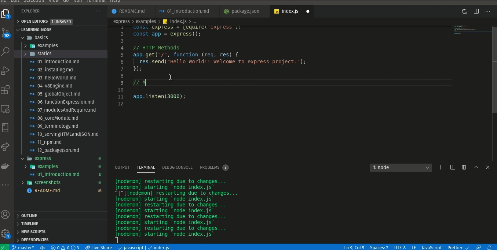
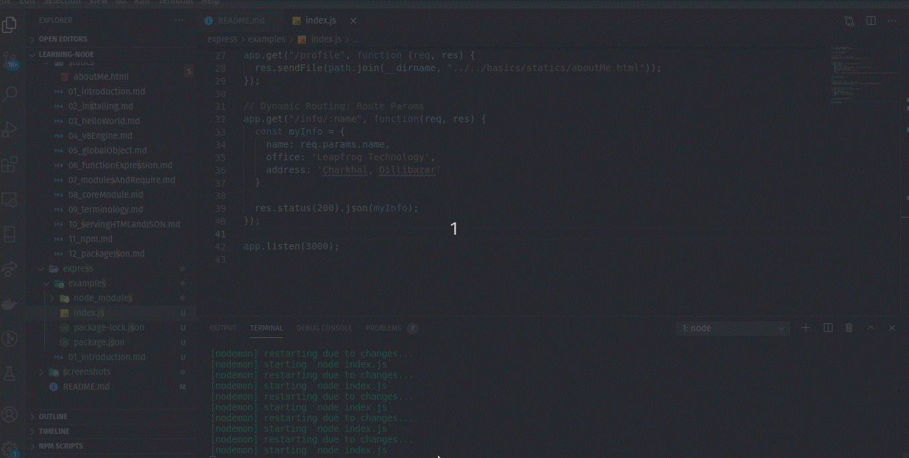

# Express

Express is a minimal and flexible Node.js web application framework that provides a robust set of features for web and mobile applications.

- Express.js, is a back end web application framework for Node.js.
- is designed for building web applications and APIs.

Express is one of the popular package in node package on the internet.

- Easy and flexible routing system
- integrates with many templating engines
- contains a middleware framework

[https://expressjs.com/](https://expressjs.com/)

### Setting up project
- install Node.js [https://nodejs.org/](https://nodejs.org/)
- create a working folder
- navigate to working folder in terminal/command prompt
- `$ npm init` and enter the descriptions, this will initialize the *package.json* file stores all your dependencies

### Getting Started

- Setting up Node.js project with `express`  
  and running the server

```javascript
const express = require("express");
const app = express();

// Responding to the requests
app.get("/", function (req, res) {
  res.send("Hello World!! Welcome to express project.");
});

// Listening to the PORT
app.listen(3000);
```


- Routing with `express`

We can simply add Routes in express for various HTTP methods.

```javascript
// Adding Routes
app.get("/aboutme", function (req, res) {
  const aboutMe = {
    name: "Aakrit Subedi",
    picUrl: "http://aakritsubedi.com.np/newProfilePic.jpg",
    job: "Software Engineer",
    education: "B.E in Computer Science",
    desc:
      "Honors student of Kantipur Engineering College, Computer Engineering. Academic credentials are reinforced by programming experience gained during an internship with some companies.Strong knowledge of object-oriented programing and web development tools using PHP and Java.Known as a self-starter, team player, and multitasker--strive to consistently exceed expectations.",
  };

  res.json(aboutMe);
});

// Sending Static File
app.get("/profile", function (req, res) {
  res.sendFile(path.join(__dirname, "../../basics/statics/aboutMe.html"));
});
```



- Express Route Params

```javascript
app.get("/profile/:id", function (req, res) {
  res.send(`You are requesting a profile for user id ${req.params.id}`);
});
```


- Express Query Strings

```javascript

// Query Strings
app.get("/information", function (req, res) {
  const myInfo = {
    name: req.query.name,
    email: req.query.email,
    office: req.query.office,
  };

  res.status(200).json(myInfo);
});
```
**url:** `http://127.0.0.1:3000/information?name=aakrit&office=leapfrog&email=aakritsubedi9@gmail.com`  



- Handling POST request

first we need to add a body-parser and use it as a middleware
```javascript
const express = require("express");
const bodyParser = require("body-parser");

// Creating an express app
const app = express();

//Here we are configuring express to use body-parser as middle-ware.
app.use(bodyParser.urlencoded({ extended: false }));
app.use(bodyParser.json());
```

and handle POST request as follow:  

```javascript
app.post("/upload", function(req, res) {
  const { name, college, email } = req.body;
  const myInfo = {
    name: name,
    college: college,
    email: email
  }
  res.status(200).json(myInfo);
});
```


---
#### Web Server example in Express.js

[Sample Code](examples)
