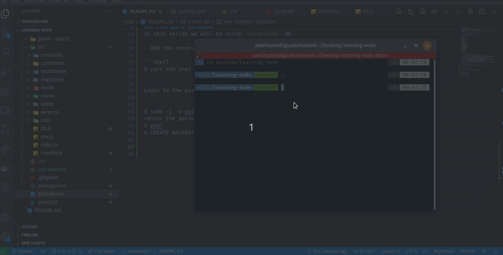
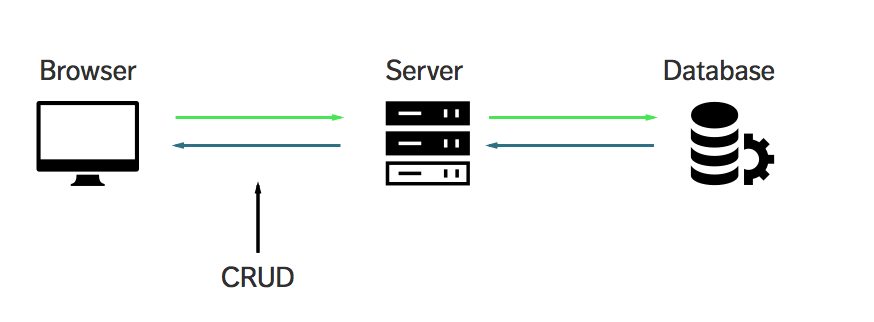
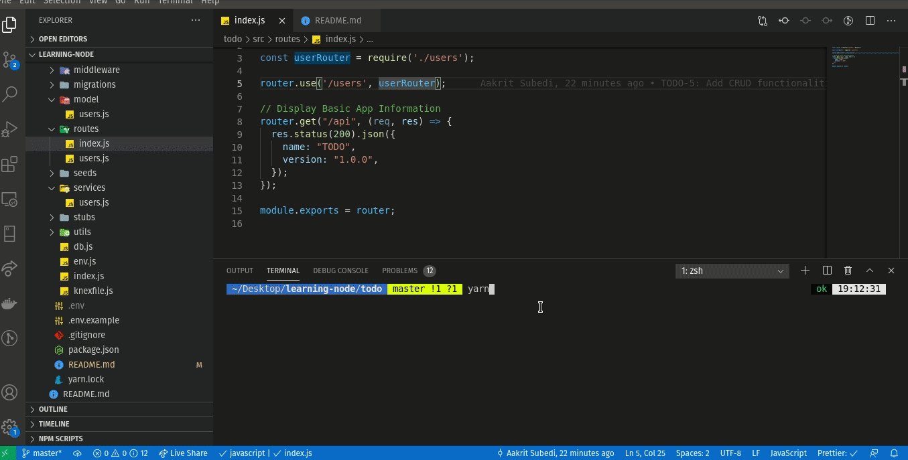
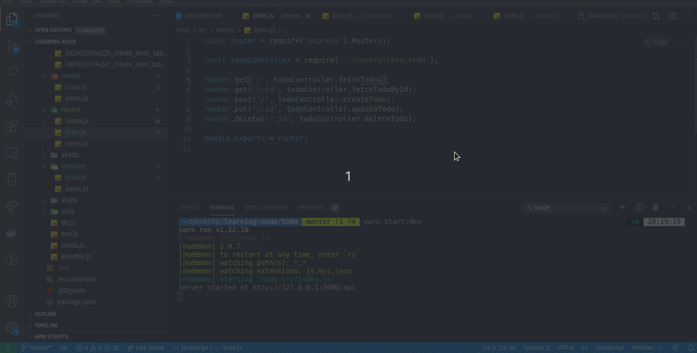

# todo api 

### Setting up project
- install Node.js [https://nodejs.org/](https://nodejs.org/)
- create a working folder
- navigate to working folder in terminal/command prompt
- `$ npm init` and enter the descriptions, this will initialize the *package.json* file stores all your dependencies


### Folder Structure
This module contains the code for REST API for todo API.

```
todo/
├── package.json
├── public
│   └── assets
├── README.md
├── src
│   ├── constants
│   ├── controllers
│   ├── db.js
│   ├── env.js
│   ├── index.js
│   ├── knexfile.js
│   ├── middlewares
│   ├── migrations
│   ├── models
│   ├── routes
│   ├── seeds
│   ├── services
│   └── utils
└── yarn.lock
```

In the directory structure shown above:

- The `src` directory contains all the major source code
- The `constants` folder contains all the constant values that we use in the application
- The `controllers` folder contains the code that handles the logic of the application
- The `middlewares` folder contains middlewares for various routes
- The `migrations` folder contains codes that map various fields to table columns
- The `models` folder contains database model of our application
- The `routes` folder contains code that routes to different endpoints of our application
- The `seeds` folder contains seed data for our database
- The `stubs` folder contains logic for stubbing our migration and seeds
- The `utils` folder contains all the utilities that we use throughout our application

### Configure database
In this series we will be using `postgreSQL` db. 

- Add the necessary packages and configure the `.env` as show in `.env.example` file.

```shell 
$ yarn add knex pg
```

- Login to the postgreSQL and create the database

```
$ sudo -i -u postgres
<enter the password>
$ psql 
$ CREATE DATABASE todo;
```



### Migrations & Seeding

- **Creating Tables**
Let's create a Users and Tasks table using the knex command line tool. In the root of our project run the following commands:

```shell
$ yarn make:migration create_users_table
$ yarn make:migration create_todos_table
```
And update the migration file im `migration` folder.  

Refer to the following examples.  
- [Create Todos Tables](./src/migrations/20210213193225_create_todo_table.js)
- [Create Users Tables](./src/migrations/20210213194241_create_user_table.js)

Now we can run the below command performing a migration and updating our local database:

```shell
$ yarn migrate
```

We should now have a new table named `users` & `todos` in our database.

- **Seeding Your Database**

Lets create some seed files in this order:

```shell
$ yarn make:seeder 01_add_users
$ yarn make:seeder 02_add_tasks
```

Now lets insert some data into our seed scripts. Refer to following example code.

- [Add Users](./src/seeds/01_add_users.js)
- [Add Todos](./src/seeds/02_add_todos.js)

Now we can run the below command in the root of our project to seed our database!

```shell
$ yarn seed
```


- **CRUD Functionalities**
CRUD is an acronym for Create, Read, Update and Delete. It is a set of operations we get servers to execute (POST, GET, PUT and DELETE requests respectively). This is what each operation does: 

|HTTP Verb|HTTP Method|Description|
|---------|-----------|-----------|
|Create|POST|Make something|
|Read|GET|Get something|
|Update|PUT|Change something|
|Delete|DELETE|Remove something|

`POST`, `GET`, `PUT`, and `DELETE` requests let us construct RESTful APIs.  

If we put CRUD, Express and Postgres together into a single diagram, this is what it would look like:



Refer to CRUD functionalities in following files: 
- `Router: ` [User Router](./src/routes/users.js) 
- `Controller: ` [User Controller](./src/controllers/users.js)
- `Services: ` [User Service](./src/services/users.js)
- `Model:` [User Model](./src/model/users.js)



Similarly, refer following files for CRUD operation for `todos`: 
- `Router: ` [Todo Router](./src/routes/todo.js) 
- `Controller: ` [Todo Controller](./src/controllers/todo.js)
- `Services: ` [Todo Service](./src/services/todo.js)
- `Model:` [Todo Model](./src/model/todo.js)



- **Authentication**
*securing RESTful APIs with {JSON Web Token}*

JSON Web Token (JWT) is a compact, URL-safe means of representing claims to be transferred between two parties. The claims in a JWT are encoded as a JSON object that is used as the payload of a JSON Web Signature (JWS) structure or as the plaintext of a JSON Web Encryption (JWE) structure, enabling the claims to be digitally signed or integrity protected with a Message Authentication Code (MAC) and/or encrypted.  

Simply, a JWT is an encoded string of characters which is safe to send between two computers if they both have HTTPS. The token represents a value that is accessible only by the computer that has access to the secret key with which it was encrypted.

Refer to this [authenticate middleware](./src/middleware/authenticate.js) used to provide access to the API system and [jwt utils](./src/utils/jwt.js) which uses package `jsonwebtoken` to validate and sign the token for the end users.


As the scale of this application is so small, so I have added a filter and authorize util function to filter the todos and authorize the logged in users for particular action as following and made necessary changes in various layers of todos. 

```javascript
// a utility function to filter the filter the todos based on userId
const filterByUserId = (userId, todos) => {
  console.log(todos, userId);
  return todos.filter((todo) => todo.user_id === userId);
};

// authorize the user to perform various actions
const isAuthorize = (userId, todo) => {
  if(todo.user_id === userId) {
    return true;
  }
  else {
    return false;
  }
}
```

In this project, I have only authorize fetch todo resources. 

- **Accessing Static Files**
to access the static files inside `/public/assets/`, simply write a complete filename as shown in example below.

[http://127.0.0.1:3000/api/buyMeCoffee.png](http://127.0.0.1:3000/api/buyMeCoffee.png)

___
### Demo: *todo-api* 


___
### Wrapping Up

We covered A LOT in this mega tutorial. Here’s a list of things we’ve done together:

0. Node.js basics
1. Understood what Express, Node, and MongoDB are used for
2. Understood CRUD
3. Executed Create, Read, Update and Delete operations
4 Save, read, update, and delete from Postgres
5. Authentication and Authorization
6. Display variable data with template engines

We have now learned all you need to know about creating simple applications with Node, Express, and Postgres.  

Now, go forth and create more applications, Mail me at [aakritsubedi9@gmail.com](aakritsubedi9@gmail.com) if you find any difficulties.

### Further reading
Here’s some further readings if you’re interested to continue with the Node, Express, Postgres journey.  

**Express articles**
- [3 useful Express middleware](https://zellwk.com/blog/express-middlewares)
- [Handling Express errors](https://zellwk.com/blog/express-errors)
- [JavaScript Async/await](https://zellwk.com/blog/async-await)
- [Using Async/await in Express](https://zellwk.com/blog/async-await-express)

**Postgres articles**
- [Postgres](https://www.enterprisedb.com/postgres-tutorials) 

**Testing related articles**
- [Endpoint testing with Jest and Supertest](https://zellwk.com/blog/endpoint-testing)

___
If you enjoyed this article, please tell a friend about it! Share it on LinkedIn. If you spot a typo, I’d appreciate if you can correct it on GitHub. Thank you!
